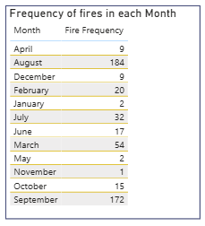

# <h1 id="ForestFireRiskAnalysis2007">Forest Fire Risk Analysis 2007</h1>

# Executive Summary
This dataset contains records of forest fires, including details such as the month, day, location (X, Y), temperature, relative humidity, wind speed, rainfall, and the area burned using 
Microsoft Excel, SQL and Power BI.

# Report Objectives
- Identify the top two fires with the largest burned area to highlight the most severe incidents in the dataset.

- Determine the frequency of fires by month to understand seasonal fire trends.

- Calculate the total burned area by month to assess which periods caused the most damage.

- Find the month with the highest average fire size to detect months with larger but possibly fewer fires.

- Identify the region with the highest fire frequency to locate geographic hotspots of fire activity.

- Highlight the fire(s) with the largest burned area to understand extreme events.

- Analyze the average temperature and relative humidity by region to examine environmental conditions linked to fire occurrence.

# Data Sources  

- The analysis is based on the Forest Fires Dataset, which contains historical records of forest fire occurrences. The dataset includes the following variables:

- Spatial Coordinates (X, Y): Location of the fire in a grid-based mapping system.

- Temporal Information: Month and day of fire occurrence.

- Meteorological Conditions: Temperature (°C), Relative Humidity (%), Wind speed (km/h), and Rainfall (mm).

- Fire Danger Indices: FFMC (Fine Fuel Moisture Code), DMC (Duff Moisture Code), DC (Drought Code), and ISI (Initial Spread Index).

- Fire Impact: Burned area (in hectares).

# Methodology
The following steps were carried out to analyze the forest fire dataset:

- Data Preparation: The Month and Day columns were cleaned and reformatted into proper full text to improve readability.
  Data types were checked and corrected where necessary to ensure accurate aggregation and calculations using Microsoft Excel.

  Data Analysis was done using SQL.
  
- Reporting: Results were summarized into key findings, with tables, charts, and visuals in Power BI to present the analysis clearly and support decision-making.

# Research Questions

- What are the details of the top two fires with the largest area burned?

- What is the frequency of fires in each month?

- What is the total area burned by fires in each month?

- find the Month with the highest average fire area?

- Identify the region with the highest frequency of fires?

- Identify the fires with largest area burned?

- Find the average temperature and relative humidity for fires that occurred in the regions?

# Data Analysis

- A Query to the details of the top 2 fires with the largest area burned.
 
  Select top 2 * From Forestfires
  Order by Area Desc

- A Query to know the frequency of fires in each Month.
 
  Select Month, count(*) As fire_count From Forestfires
  Group by Month
  Order by fire_count Desc

 - A Query to the total area burned by fires in each Month.
  
   Select Month, sum(Area) As total_area From Forestfires
   Group by Month 
   Order by total_area Desc

  - A Query to find the Month with the highest average fire area.
   
    Select top 1 Month, avg(area) As avg_area
    From Forestfires
    Group by month
    Order by avg_area Desc

  - A Query to Identify the region with the highest frequency of fires.
   
    Select top 1 X,Y, count(*) As fire_count From Forestfires
    Group by X,Y
    Order by fire_count Desc

  - A Query to Identify the fires with largest area burned.
   
    SELECT * FROM forestfires
    WHERE Area = (SELECT MAX(Area)
    FROM forestfires)

 -  A Query to Find the average temperature and relative humidity for fires that occurred in the regions.
   
    Select x,y, avg(temp) as avg_temp, avg(RH) As AVG_RH From Forestfires
    group by x, y

# Results

- The analysis revealed that the two largest fires occurred in September (1,090.84 ha at X=6, Y=5) and August (746.28 ha at X=8, Y=6), both of which burned significantly larger areas than most other incidents.

- Frequency of fires in each Month.
 

- The highest total burned area was observed in September with approximately 3,086 ha, followed by August with about 2,298 ha, showing that these two months contributed the majority of the overall fire damage.

- Although August and September recorded the largest totals, May had the highest average fire size of about 19.24 ha per fire, which suggests that while fewer fires occurred that month, they tended to be larger.

- The most fire-prone region was identified as (X=8, Y=6), which experienced 52 separate fire incidents, making it the highest-risk geographic location.

- The single largest fire event in the dataset occurred in September at (X=6, Y=5), burning 1,090.84 ha, and stands out as the most severe case.

- Environmental conditions also played a role, as regions with higher average temperatures (20–27°C) and lower relative humidity (32–46%) were more fire-prone, with region (1,5) serving as an example where an average temperature of 25°C and humidity of 32% coincided with increased fire activity.

# Findings

- Largest Fires: The two biggest fires occurred in September (1,090.84 ha at X=6, Y=5) and August (746.28 ha at X=8, Y=6). Both incidents burned significantly larger areas compared to     the majority of other fires.

- Fire Frequency by Month: Fires occurred most often in August (184 fires) and September (172 fires), showing that late summer/early autumn is the most fire-prone period. Fewer fires      were recorded in months such as February (20 fires).

- Total Area Burned by Month: The highest total burned area was in September (≈3,086 ha) followed by August (≈2,298 ha). Together, these two months accounted for the majority of fire      damage.

- Average Fire Size by Month: Although August and September had the highest total fire damage, May recorded the highest average fire size (≈19.24 ha per fire). This indicates fewer        fires occurred in May, but they were larger in scale.

- Geographic Hotspot: The most fire-prone region was (X=8, Y=6), with 52 fire incidents, marking it as the highest-risk location.

- Extreme Event: The largest single fire occurred in September (X=6, Y=5, 1,090.84 ha), making it the most severe fire in the dataset.

- Environmental Conditions: Regions with higher average temperatures (20–27°C) and lower relative humidity (32–46%) tended to experience more fires. For example, region (1,5) had an       average temperature of 25°C and low humidity (32%), aligning with fire-prone conditions.

# Recommendations

- Focus Preventive Measures in High-Risk Months: Since most fires occur in August and September, with the highest total burned areas, fire management authorities should intensify prevention campaigns, monitoring, and readiness during these months.

- Strengthen Fire Control in Hotspot Regions: The region (X=8, Y=6), which recorded the highest frequency of fires, should be prioritized for fire watch towers, rapid response teams, and community awareness programs.

- Target Large-Scale Fires in May: Although fewer fires occurred in May, they were significantly larger on average. Authorities should allocate additional resources in this month to prevent large-scale damage.

- Monitor Environmental Conditions: Regions with high temperatures and low humidity (20–27°C and 32–46% RH) should be continuously monitored, as these conditions are strongly linked to fire outbreaks. Early-warning systems could be based on these parameters.

- Improve Firefighting Resources and Training: Since extreme events such as the 1,090.84 ha fire in September are possible, firefighting units should be equipped with specialized equipment and trained for handling large-scale fires.

- Community Awareness and Engagement: Local communities should be educated about fire risks, especially in fire-prone months, to reduce human-caused ignitions and promote responsible land use practices.

- Policy and Planning Support: Fire data should be integrated into long-term land management policies, ensuring that regions with recurring fire risks receive investments in prevention infrastructure, reforestation, and firebreak creation.

# Possible Limitations

- Geographic Scope: The dataset is restricted to specific coordinates (X, Y grid system), which may not represent all forest fire patterns in wider regions or different ecosystems.

- Temporal Coverage: The dataset only covers the months and years included in the file. Fires occurring outside this time frame were not captured, limiting the ability to generalize       long-term trends.

- Data Granularity: While the dataset provides monthly and daily information, it does not include exact dates, durations, or times of fire events, which could give a more detailed temporal analysis.

- Lack of Cause Information: The dataset does not specify the causes of the fires (e.g., lightning, human activity, agricultural burning), which limits the ability to recommend targeted preventive strategies.

- Environmental Variables: Although temperature, humidity, wind, and rainfall are included, other important environmental factors such as vegetation type, soil condition, or fuel availability were not recorded, which may influence fire behavior.

- Severity Measure: Fire impact is measured only by the burned area (in hectares). Other measures of severity (e.g., ecological damage, economic cost, loss of biodiversity) are not included.

- Data Quality Issues: The dataset required cleaning, such as reformatting the Month and Day columns. This suggests potential inconsistencies or limitations in the original data collection.

# Conclusion 

  This analysis of the forest fire dataset has provided meaningful insights into the patterns, scale, and conditions of fire occurrences. The study revealed that the most severe fires     occurred in September and August, both in terms of frequency and total area burned, with September recording the single largest fire event of 1,090.84 hectares. While these months       posed the greatest overall risk, the month of May stood out with the highest average fire size, highlighting that fewer but more destructive fires can also occur outside the peak        season.

  Geographically, the region at (X=8, Y=6) was identified as the most fire-prone location, emphasizing the need for targeted monitoring and preventive measures. Environmental analysis     further showed that fires were more likely under high temperature and low humidity conditions, reinforcing the importance of weather-based fire prediction and early warning systems.

  The findings suggest that effective forest fire management should focus on seasonal preparedness, regional risk monitoring, and community awareness, while also equipping firefighting    units to handle extreme events. Although the dataset has limitations—such as the lack of information on fire causes and broader ecological impacts—it still provides a strong             foundation for data-driven decision-making.

  Overall, this report demonstrates how structured data analysis using SQL and visualization tools can uncover critical patterns that support proactive fire prevention, resource           allocation, and policy planning to reduce the devastating effects of wildfires.

